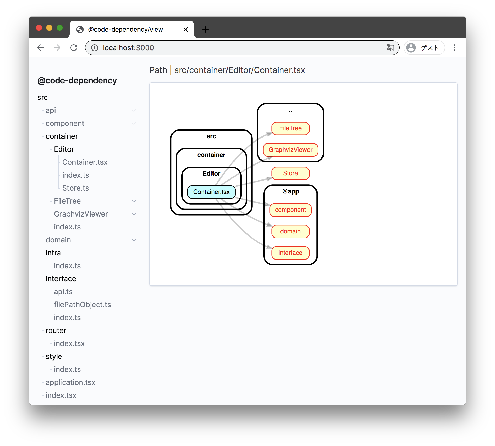

# @code-dependency

## Install

```bash
yarn global add @code-dependency/cli
```

## Usage

```bash
code-dependency --source ./src
# open localhost:3000
```

see [other option](./packages/cli/README.md#option).



## Core development UI / APi

- **sverweij/dependency-cruiser** https://github.com/sverweij/dependency-cruiser

## Development

Run webpack-dev-server for @code-dependency/view

```bash
cd packages/view
yarn start
```

Run api server for @code-dependency/cli

```bash
yarn start
```

## License

code-dependency is [MIT licensed](https://github.com/Himenon/code-dependency/blob/master/LICENSE).
